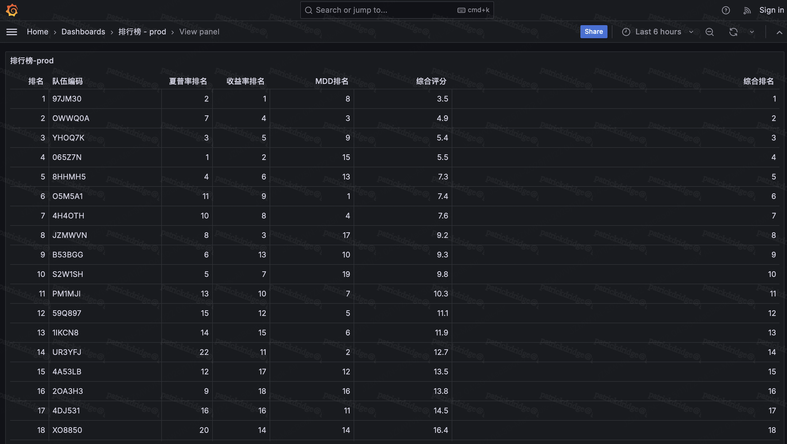
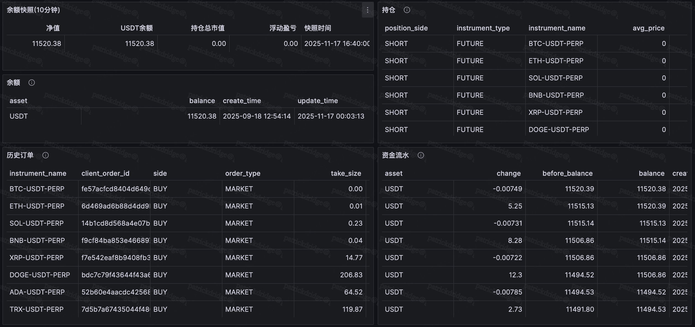

# Avenir–HKU Quantitative Trading Challenge 2025 — Team S1mple

> **Top 10 Finalist · +15.20% Return · 3rd in Returns · 8th Overall**
>
> Patrick Ridge (University of St Andrews) · Anthony Grishin (Imperial College London) · George Gui (Imperial College London)

---

## Competition Overview

The Avenir–HKU Quantitative Trading Challenge 2025 was a two-round quant competition run out of Hong Kong.

### Round 1 — Prediction Task

- **Dataset:** 355 cryptocurrencies, Binance futures OHLCV data, 2021–2024 (15-min candles)
- **Goal:** Predict 24-hour-ahead returns at 15-minute intervals across all coins
- **Evaluation:** Weighted Spearman rank correlation — with particular emphasis on correctly identifying the highest and lowest expected returns

### Round 2 — Live Trading

- **Allocation:** $10,000 USDT per team
- **Access:** API only — data feed, order placement, balance checks (via OMS)
- **Positions:** Long and short crypto perpetual futures, real-time execution
- **Scoring:** Composite score = 40% Sharpe Ratio + 30% Return + 30% Max Drawdown
- **Bonus:** 20% of profits returned to the team if max drawdown ≤ 15%
- **Infrastructure:** Lark, Yushu, QuantBase, GitLab — run on a VM due to software compatibility constraints on the competition machines

---

## Results

| Metric       | Value          | Rank   |
|--------------|----------------|--------|
| Final NAV    | 11,520.38 USDT | —      |
| Total Return | **+15.20%**    | **3rd** |
| Sharpe Ratio | —              | 8th    |
| **Overall**  |                | **8th / 20 teams** |

### Leaderboard (Final)



### Trading Dashboard



---

## Strategy

### Round 1 — XGBoost Prediction Model

We chose XGBoost after reviewing literature on crypto forecasting (including Nayeem Pinky & Akula, *Enhancing Cryptocurrency Market Forecasting*). Tree-based models handle non-linear relationships in noisy financial data well while remaining efficient enough for local training.

**Model configuration:**

| Parameter | Value |
|-----------|-------|
| Tree method | Histogram (fast, scalable) |
| Boosting rounds | 300 |
| Max depth | 6 |
| Learning rate | 0.05 |

**14 engineered features:**

| Category | Features |
|----------|----------|
| Momentum | RSI, 7-day momentum |
| Moving averages | MACD, EMA |
| Volatility | Bollinger Bands, 1d volatility, 7d volatility |
| Volume | 7-day average volume |
| Lagged returns | 1h, 4h, 1d, 7d |

All features were normalised before training to prevent any single indicator from dominating model outputs.

**Spearman correlation results:**

| Split | Score |
|-------|-------|
| In-sample | 0.3113 |
| Out-of-sample | 0.1225 |

The gap indicates some overfitting, though the out-of-sample score remained competitive given the model's simplicity relative to the task.

---

### Round 2 — Live Execution Strategy

The Round 1 model was applied directly to live trading. Core logic:

1. **Threshold filter** — only trade assets with predicted return magnitude > 2%. This aligns with the competition's evaluation focus on correctly ranking extreme predicted moves.

2. **Strength-weighted allocation** — 90% of account balance distributed proportionally to prediction magnitude. Assets with larger predicted moves receive proportionally larger position sizes.

3. **Fee adjustment** — 0.046% transaction cost factored into position sizing.

4. **Stop-loss** — added after the October 10th market crash. Long positions: stop at -2%. Short positions: stop at +2%.

**Key learning:** The initial strategy traded only 5 symbols (BTC, ETH, SOL, BNB, XRP), concentrating risk. After expanding to a broader set of perpetuals, portfolio volatility dropped and performance improved significantly over the second month.

---

## Future Improvements

- Replace the fixed 2% threshold with a volatility-based threshold (e.g., derived from Bollinger Bands width)
- Automate stop-loss sizing via ML rather than fixed percentages
- Build a multi-asset backtesting framework for strategy validation before live deployment
- Incorporate external data sources (on-chain metrics, sentiment indices)

---

## Repository Structure

```
├── jzmwvn/                     # Main strategy (jzmwvn = team OMS identifier)
│   ├── demo.py                 # Live trading bot — runs daily at 08:00 UTC
│   ├── XGBoostround1.py        # Model training script
│   ├── trained_xgb_model.json  # Trained XGBoost model
│   ├── fitted_scaler.pkl       # Fitted StandardScaler for feature normalisation
│   ├── requirements.txt        # Python dependencies
│   ├── run.sh                  # Entry point (set OMS credentials in .env first)
│   ├── README.md               # Technical docs
│   └── sdk/
│       ├── oms_client.py       # OMS REST API wrapper
│       └── README.md           # SDK docs
└── assets/
    ├── leaderboard.png
    └── dashboard.png
```

---

## Quick Start

```bash
git clone https://github.com/patrickridge/AVENIR-HKU-WEB3.0-QUANTITATIVE-TRADING-CHALLENGE-2025.git
cd avenir-hku-2025

# Install dependencies
pip install -r jzmwvn/requirements.txt

# Set up credentials
cp .env.example .env
# Edit .env — fill in OMS_URL and OMS_ACCESS_TOKEN

# Run the strategy
cd jzmwvn
source ../.env
bash run.sh
```

> **Note:** The trained model (`trained_xgb_model.json`) and scaler (`fitted_scaler.pkl`) are included, so inference works immediately without retraining. To retrain, supply your own OHLCV parquet data and run `XGBoostround1.py`.

---

## Team

| Name | University | Degree | Role |
|------|-----------|--------|------|
| Patrick Ridge | University of St Andrews | Mathematics & Physics | Team Lead |
| Anthony Grishin | Imperial College London | Mathematics | Strategy Research |
| George Gui | Imperial College London | Mathematics | Risk Analysis |

